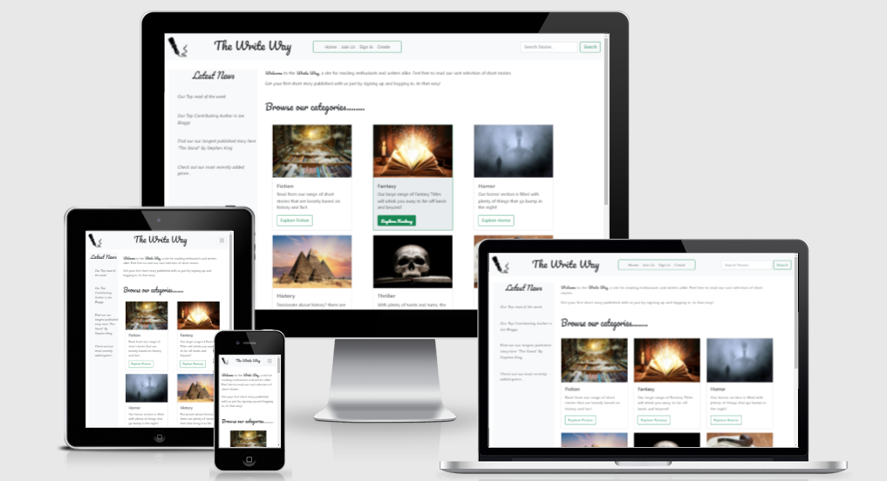

<h1 align="center">The Write Way</h1>

- [View the live project here ](https://the-write-way.herokuapp.com/)

The Write Way is a service that allows budding authors to submit and share short stories.

The stories are accessible to casual readers as well as other writers.

&nbsp;
&nbsp;

  

----
## User Experience
----

-   ### User stories

    -   #### First Time Visitor Goals

        1. As a First Time Visitor, I want to easily understand the main purpose of the site.
        2. As a First Time Visitor, I would like to browse the sites content without signing up or logging in.
        
    -   #### Returning Visitor Goals

        1. As a Returning Visitor, I would like create my own login profile to allow me create content.
        2. As a Returning Visitor, I would like to easily connect with the sites social media channels.
        

    -   #### Frequent User Goals
        
        1. As a Frequent Visitor, I would like create another short story.
        2. As a Frequent Visitor, I would like read back over one of my recently added short stories.
        3. As a Frequent Visitor, I would like edit one of my recently added short stories.
        4. As a Frequent Visitor, I would like remove one of my recently added short stories.

-   ### Design
    -   #### Colour Scheme
        -   The colour palette used for the site is listed below.
            -  `Green Transistion`
            -  `Black Transistion`
            -  `White`
            -  `Light Green Transistion`
            -  `Dark Green Transistion`
            -  `Charcoal Transistion`
            
    -   #### Typography
        -   The Pacifico font was used in places around the site to give its overall signature and feel. Not only is it an attractive font but it also looks handwritten to fit in with the overall theme. 
        The Roboto font was used as the main body font due to its readability and popularity on countless other sites as as always should these font be inaccessable san-serif was chosen to be the backup font.

    -   #### Imagery
        - I chose not to add to much imagery beyond what was necessary so as not to distract Readers and Writers from the true purpose of the site, that is the enjoyment of reading and writing content. Any imagery that was chosen, its purpose is to convey an instant message to the visitor.

*   ### Wireframes

    - Desktop Wireframes - [View here](/assets/docs/wireframes/TheWriteWay-SiteMap&Desktop-Layout.pdf)
    - Tablet Wireframes - [View here](/assets/docs/wireframes/TheWriteWay-SiteMap&Tablet-Layout.pdf)
    - Mobile Wireframes - [View here](/assets/docs/wireframes/TheWriteWay-SiteMap&Mobile-Layout.pdf)

*   ### Screenshots
    - Some screenshots of the site - [View here](/assets/docs/screenshots.pdf)

## Features

-   Responsive on all device sizes

-   Interactive elements

-   Create and Save your own content

-   CRUD functionality for valid users

## Technologies Used

### Languages Used

-   [HTML5](https://en.wikipedia.org/wiki/HTML5)
-   [CSS3](https://en.wikipedia.org/wiki/Cascading_Style_Sheets)
-   [Javascript](https://en.wikipedia.org/wiki/JavaScript)
-   [Python 3](https://en.wikipedia.org/wiki/Python_(programming_language))

### Databases Used

-   [MongoDb](https://en.wikipedia.org/wiki/MongoDB)

### Services Used

-   [Heroku](https://en.wikipedia.org/wiki/Heroku)
-   [GitHub:](https://en.wikipedia.org/wiki/github)
    

### Frameworks, Libraries & Programs Used

1. [Materialize:](https://materializecss.com/)
    - Materialize instead of Bootstrap was used on this project to assist with the responsiveness and styling of the website.
2. [JQuery:](https://code.jquery.com/)
    - Some JQuery was used to simplify frontend deployment.  
3. [Google Fonts:](https://fonts.google.com/)
    - Google fonts were used to import the "Saria Stencil One" font into the style.css file which is used on all pages throughout the site.
4. [Font Awesome v5.15.4:](https://fontawesome.com/)
    - Font Awesome was used on all pages throughout the website to add icons for aesthetic and UX purposes.
5. [GitPod](https://www.gitpod.io/)
    - GitPod was used as the main development platform, this was linked to my GitHub repository.
6. [Paint.net:](https://www.getpaint.net/doc/latest/index.html)
    - Paint.net was used for resizing images and editing photos for the website.
7. [Balsamiq:](https://balsamiq.com/)
    - Balsamiq 4.2.1 was used to create the WireFraming during the design process.

## Testing

The W3C Mark-up Validator and W3C CSS Jigsaw Validator Services were used to validate every page of the project to ensure there were no syntax errors in the project.

-   [W3C Mark-up Validator](https://jigsaw.w3.org/css-validator/#validate_by_input) - [Results](/assets/docs/Html-Css-results.pdf)
-   [W3C CSS Validator](https://jigsaw.w3.org/css-validator/#validate_by_input) - [Results](/assets/docs/Html-Css-results.pdf)
-   [JSHint ](https://jshint.com/) - [Results](/assets/docs/JSHint.pdf)

### Testing User Stories from User Experience Section

### Users Stories
-   #### First Time Visitor Goals

    1. As a First Time Visitor, I want to easily understand the main purpose of the site.

        1. Upon landing on the main page users are greeted with a clean site whose imagery and text convey a message that the sites primary goal revolves around writing and storytelling.
        

    2. As a First Time Visitor, I would like to browse the sites content without signing up or logging in.

        1. The site has been designed to give a good and unimpeded flow from start to end.
        2. The sites categories and most of its content are freely availible to unregistered users. 

    
-   #### Returning Visitor Goals

    1. As a Returning Visitor, I would like create my own login profile to allow me create content.

        1. A returning visitor to the site can choose the 'Signup' button or 'Login' from the main navigation menu. From here they are invited to complete the signup process.

    
    2. As a Returning Visitor, I would like to easily connect with the sites social media channels.

        1. A returning visitor can use the social media links at the bottom of the page to connect with a larger audience.

-   #### Frequent User Goals

    1. As a Frequent Visitor, I would like create another short story.

        1. The user first needs a valid logon. Once logged in they can go to their profile page and choose the 'Create New' button. They then shoose a category for their story along with a public or private setting, lastly when they are finshed writing, they can submit the short story by clicking the 'Submit' button. 
        
    2. As a Frequent Visitor, I would like read back over one of my recently added short stories.

        1. The user in this case can be either logged in or not. From here they can browse the caterogries and find their story, or if they do login they cna view their work from within the profile.

    3. As a Frequent Visitor, I would like edit one of my recently added short stories.

        1. The user will need to be logged in for this task also, once logged in they can go to their profile page, locate the peice of work that there interested in changing and choose the edit function, once happy with the changes they can click the 'Submit' button.
    
    4. As a Frequent Visitor, I would like remove one of my recently added short stories.

        1. The user again will need to be logged in for this task. From here they can go to their profile page, locate the peice of work that there interested in and choose the delete button to remove it.
        
### Further Testing

-   The Website was tested on Google Chrome, Opera, Internet Explorer 11, Microsoft Edge and Firefox browsers.
- The website was continually checked on a variety of emulated devices under Chromes Developer tools, these included Desktop, Moto4, GalaxyS5, Pixel, IPhones5,6,7,8,X, IPad/Pro and the Surface Duo.
-   Internal and external linking were continually tested throughout the project to ensure functionality.
-   Family members were asked to review the site and to give their initial thoughts and feedback. Their input was used to make small design changes to all 3 games.

### Known Bugs

-  [Results](/assets/docs/known-bugs.pdf)

## Deployment
&nbsp;

The project was deployed using the steps below.

### MongoDb

[Steps to setup MongoDb](assets/docs/setup-and-deployment/setting_up_mongo_db.pdf)

### GitHub

[Steps to setup GitHub](assets/docs/setup-and-deployment/github-setup-and-instructions.pdf)

### GitPod

[Steps to setup GitPod](assets/docs/setup-and-deployment/setting_up_gitpod.pdf)

### Heroku

[Steps to deploy to Heroku](assets/docs/setup-and-deployment/deploying_to_heroku.pdf)

## Credits

### Code

- All code written by myself except for .....

### Content

-   Privacy Policy - Some of the privacy policy was borrowed from [this link](https://www.booksie.com/member/privacy-policy) to save time on the project. 
-   The remaining content was written by myself with some minor contributions by family and friends.

&nbsp;
# README DONE TO HERE !
### Media

Images

The images on the index page were chosen from the following sources.

[1 - Big Red Button A](https://pixabay.com/photos/button-light-bright-symbol-icon-2816448/)

[2 - ]()

[3 -  ]()

[4 - ]()

[5 - ]()

The images on the 'X' page were chosen from the following sources.

[1 - Big Red Button A](https://pixabay.com/photos/button-light-bright-symbol-icon-2816448/)

[2 - ]()

[3 - ]()

[4 - ]()

[5 - ]()

The images on the 'X' page were chosen from the following sources.

[1 - Big Red Button A](https://pixabay.com/photos/button-light-bright-symbol-icon-2816448/)

[2 - ]()

[3 - ]()

[4 - ]()

[5 - ]()

The images on the 'X' page were chosen from the following sources.

[1 - Big Red Button A](https://pixabay.com/photos/button-light-bright-symbol-icon-2816448/)

[2 - ]()

[3 - ]()

[4 - ]()

[5 - ]()

### Acknowledgements
- My Mentor
- Friends and family for input and site testing.
