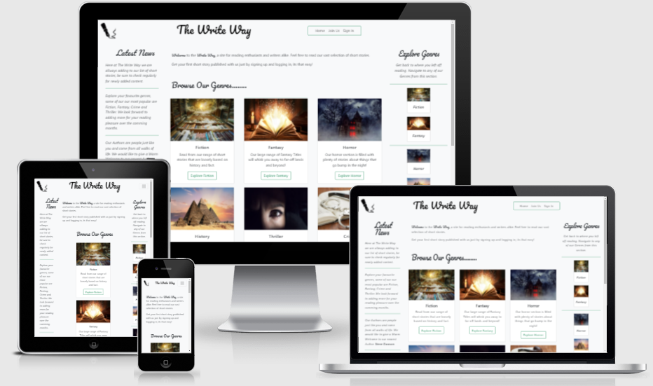

<h1 align="center">The Write Way</h1>

- [View the live project here ](https://the-write-way.herokuapp.com/)

The Write Way is a service that allows budding authors to submit and share short stories.

The stories are accessible to casual readers as well as other writers.

&nbsp;
&nbsp;

  

----
## User Experience
----

-   ### User stories

    -   #### First Time Visitor Goals

        1. As a First Time Visitor, I want to easily understand the main purpose of the site.
        2. As a First Time Visitor, I would like to browse the sites content without signing up or logging in.
        3. As a First Time Visitor, I would like to sign up and create an account.
        4. As a First Time Visitor, I would like to sign into my profile and create my first story.
        
    -   #### Returning Visitor Goals

        1. As a Returning Visitor, I've forgotten my password and need to reset it. 
        2. As a Returning Visitor, I would like to login into my profile and 'like' the stories I read.
        3. As a Returning Visitor, I've changed my mind and would like to delete the story I earlier added.
         
        

    -   #### Frequent User Goals
        
        1. As a Frequent Visitor, I would like create another short story.
        2. As a Frequent Visitor, I would like edit one of my short stories.
        3. As a Frequent Visitor, I would like remove one of my short stories.
        4. As a Frequent Visitor, I would like read back over one of my recently added short stories.

-   ### Design
    -   #### Colour Scheme
        -   The colour palette used for the site is listed below.
            -  `Green Transistion`
            -  `Black Transistion`
            -  `White`
            -  `Light Green Transistion`
            -  `Dark Green Transistion`
            -  `Charcoal Transistion`
            
    -   #### Typography
        -   The Pacifico font was used in places around the site to give its overall signature and feel. Not only is it an attractive font but it also looks handwritten to fit in with the overall theme. 
        The Roboto font was used as the main body font due to its readability and popularity on countless other sites as as always should these font be inaccessable san-serif was chosen to be the backup font.

    -   #### Imagery
        - I chose not to add to much imagery beyond what was necessary so as not to distract Readers and Writers from the true purpose of the site, that is the enjoyment of reading and writing content. Any imagery that was chosen, its purpose is to convey an instant message to the visitor.

*   ### Wireframes

    - Desktop Wireframes - [View here](/assets/docs/wireframes/TheWriteWay-SiteMap&Desktop-Layout.pdf)
    - Tablet Wireframes - [View here](/assets/docs/wireframes/TheWriteWay-SiteMap&Tablet-Layout.pdf)
    - Mobile Wireframes - [View here](/assets/docs/wireframes/TheWriteWay-SiteMap&Mobile-Layout.pdf)

*   ### Screenshots
    - Some screenshots of the site - [View here](/assets/docs/TheWriteWay-screenshots.pdf)

## Features

-   Responsive on all device sizes

-   Interactive elements

-   Create and Save your own content

-   CRUD functionality for valid users

## Technologies Used

### Languages Used

-   [HTML5](https://en.wikipedia.org/wiki/HTML5)
-   [CSS3](https://en.wikipedia.org/wiki/Cascading_Style_Sheets)
-   [Javascript](https://en.wikipedia.org/wiki/JavaScript)
-   [Python 3](https://en.wikipedia.org/wiki/Python_(programming_language))

### Databases Used

-   [MongoDb](https://en.wikipedia.org/wiki/MongoDB)

### Services Used

-   [Heroku](https://en.wikipedia.org/wiki/Heroku)
-   [GitHub:](https://en.wikipedia.org/wiki/github)
    

### Frameworks, Libraries & Programs Used

1. [Materialize:](https://materializecss.com/)
    - Materialize instead of Bootstrap was used on this project to assist with the responsiveness and styling of the website.
2. [JQuery:](https://code.jquery.com/)
    - Some JQuery was used to simplify frontend deployment.  
3. [Google Fonts:](https://fonts.google.com/)
    - Google fonts were used to import the "Saria Stencil One" font into the style.css file which is used on all pages throughout the site.
4. [Font Awesome v5.15.4:](https://fontawesome.com/)
    - Font Awesome was used on all pages throughout the website to add icons for aesthetic and UX purposes.
5. [GitPod](https://www.gitpod.io/)
    - GitPod was used as the main development platform, this was linked to my GitHub repository.
6. [Paint.net:](https://www.getpaint.net/doc/latest/index.html)
    - Paint.net was used for resizing images and editing photos for the website.
7. [Balsamiq:](https://balsamiq.com/)
    - Balsamiq 4.2.1 was used to create the WireFraming during the design process.

## Testing

The W3C Mark-up Validator and W3C CSS Jigsaw Validator Services were used to validate every page of the project to ensure there were no syntax errors in the project.

-   [W3C Html Mark-up Validator](https://jigsaw.w3.org/css-validator/#validate_by_input) - [Results](/assets/docs/testing-and-troubleshooting/)
-   [W3C CSS Validator](https://jigsaw.w3.org/css-validator/#validate_by_input) - [Results](/assets/docs/testing-and-troubleshooting/css-results.pdf)
-   [JSHint ](https://jshint.com/) - [Results](/assets/docs/testing-and-troubleshooting)
-   [pylint ](https://pylint.org/) - [Results](/assets/docs/testing-and-troubleshooting/pylint-results.pdf)
-    Code Refactoring  - [Results](/assets/docs/testing-and-troubleshooting/code-refactoring.pdf)

### Testing User Stories from User Experience Section

### Users Stories
-   #### First Time Visitor Goals

    1. As a First Time Visitor, I want to easily understand the main purpose of the site.

        1. Upon landing on the main page users are greeted with a clean site whose imagery and text convey a message that the sites primary goal revolves around writing and storytelling.
        

    2. As a First Time Visitor, I would like to browse the sites content without signing up or logging in.

        1. The site has been designed to give a good and unimpeded flow from start to end.
        2. The sites categories and most of its content are freely availible to unregistered users. 

    3. As a First Time Visitor, I would like to sign up and create an account.

        1. As a first time vistor they are presented with 3 navigation links. 'Home' brings users back to the home page. 'Sign In' brings the users to the sign in page, if they click this by accident there is a link to 'Join Us' page called 'No Account?'. The last item is the 'Join Us' link which allows the users to easily sign up in a matter of minutes.
    
    4.  As a First Time Visitor, I would like to sign into my profile and create my first story.

        1. As a first time visitor after signing up, the user can navigate to the 'Sign In' page and login. Inside in the 
        profile page the user can click on 'Create A New Story' and from there create their own content.

-   #### Returning Visitor Goals

    1. As a Returning Visitor, I've forgotten my password and need to reset it.

        1. As a returning visitor to the site, when the user clicks on the 'Sign In' page and realises they can't
        remember their password, there is a link on the 'Sign In' page called 'Forgot Password'. On navigating to this
        the user is brought to the 'Reset Password' page, the user then enters their 'Pen Name' and after choosing a new password hits the 'Reset Password' to complete the process. The user is then redirected back to the 'Sign In' page, where they can try again. If the user enters an incorrect 'Pen Name' or makes on up that is not in the database, they get the message Please Check Your 'Pen Name' and 'Password'. 

    
    2. As a Returning Visitor, I would like to login into my profile and 'like' the stories I read.

        1. As a returning vistor to the site they will have noticed a 'Like Story' button at the end of each Short Story.
        As a registered user you can 'Like' a story which updates it popularity rating. The most popular stories are then listed at the top of each Genre page according to the popularity number. A simple click will update the number on story, close the reading pane and return the user to the top page to discourage multiple clicks. Should the user click on the 'Like Story' without being signed in, they will be redirected to the 'Sign In' page along with the message 'You Need To Be Signed Into 'Like' A Story'.

    3. As a Returning Visitor, I've changed my mind and would like to delete the story I earlier added.

        1. As a returning visitor to the site, they will first need to sign in to access their profile page. From the profile page they need to choose the link 'Delete Existing Story'. This bring them to a page which lists all the short stories that the current logged in user has created. To delete a story the user needs to click on the 'Delete Story' button, in case the user clicks on it by accident, there is a check box that prevents this. The story can then be removed once the 'Check Box to Confirm' is ticked. Alternatively if the user gets cold feet and does not want to remove his content, placed above each 'Delete Story' is a larger green button labelled 'Cancel and Return to Profile'.

-   #### Frequent User Goals  
        
        
    1. As a Frequent Visitor, I would like create another short story.

        1. The user first needs a valid logon. Once logged in they can go to their profile page and choose the 'Create A New Story' button. They then need to choose 1. A Genre for their story. 2. Write a story title. 3. Write a short  story plot. 4. Pen their masterpeice in the Story content section. Lastly the user just needs to agree to the Terms and conditions of the site and hit 'Publish Story'. If the user decides they would prefer to read 'Privacy Policy' before agreeing to the terms and conditions there is a link called 'Read Privacy Policy' underneath the checkbox. This will open in a new tab so as preserving the users content in the orginal page.
        
    2. As a Frequent Visitor, I would like edit one of my short stories.

        1. The user first needs a valid logon. Once logged in they can go to their profile page and choose the 'Edit An Existing Story' button. Here they are presented with all the stories the user has published. On each story the user has the abilty to edit. 1. The Title. 2. The Plot 3. The Story Content. Once happy with the changes the user just needs to 'Check the Box to Confirm' and click the yellow button 'Update Story' to complete the changes. Should the user change their mind before saving, they can select the large green button labelled 'Cancel and Return to Profile' to exit the current task.

    3. As a Frequent Visitor, I would like remove one of my short stories.

        1. The user will need to be logged in for this task also. From the profile page they need to choose the link 'Delete Existing Story'. This bring them to a page which lists all the short stories that the current logged in user has created. To delete a story the user needs to click on the 'Delete Story' button, in case the user clicks on it by accident, there is a check box that prevents this. The story can then be removed once the 'Check Box to Confirm' is ticked. Alternatively if the user gets cold feet and does not want to remove his content, placed above each 'Delete Story' is a larger green button labelled 'Cancel and Return to Profile'.
      
    4. As a Frequent Visitor, I would like read back over one of my recently added short stories.
        
        1. For this task the user has 2 options. 1. They can be logged out and just navigate to the specific genre and find their story. 2. The user can be logged in and from their profile page they can just click the link that says 'Continue on Reading'. Alternatively they can click the specific genre on right hand side naigation menu and browse to their story.

### Further Testing

-   The Website was tested on Google Chrome, Opera, Internet Explorer 11, Microsoft Edge and Firefox browsers.
- The website was checked on a variety of emulated devices under Chromes Developer tools, these included Desktop, Moto4, GalaxyS5, Pixel, IPhones5,6,7,8,X, IPad/Pro and the newer Nest Hub and Nest Hub Max.
-   Internal and external linking were tested throughout the project to ensure functionality.
-   Family members were asked to review the site and to give their initial thoughts and feedback. Their input was used to make small design changes to parts of the site.

### Known Bugs

-  [Results](/assets/docs/testing-and-troubleshooting/known-bugs.pdf)

## Deployment
&nbsp;

The project was deployed using the steps below.

### MongoDb

[Steps to setup MongoDb](assets/docs/setup-and-deployment/setting_up_mongo_db.pdf)

### GitHub

[Steps to setup GitHub](assets/docs/setup-and-deployment/github-setup-and-instructions.pdf)

### GitPod

[Steps to setup GitPod](assets/docs/setup-and-deployment/setting_up_gitpod.pdf)

### Heroku

[Steps to deploy to Heroku](assets/docs/setup-and-deployment/deploying_to_heroku.pdf)

## Credits

### Code

- All code written by myself except for .....

### Content

-   Privacy Policy - Some of the privacy policy was borrowed from [this link](https://www.booksie.com/member/privacy-policy) to save time on the project. 
-   The remaining content was written by myself with some minor contributions by family and friends.

&nbsp;

### Media

Images

The images on the Home Page / Genre Template were chosen from the following sources.

[1 - Image for Fiction Section](https://pixabay.com/photos/library-heaven-birds-mystical-425730/)

[2 - Image for Fantasy Section](https://images.app.goo.gl/Wp2AC4okZsQF1MgRA)

[3 - Image for Horror Section ](https://www.scimex.org/newsfeed/imagine-your-worst-nightmare-some-people-just-cant)

[4 - Image for History Section](https://www.businessclass.com/destinations/articles/cairo---much-more-than-the-pyramids-of-giza-)

[5 - Image for Thriller Section](https://bit.ly/3eB7c2a)

[6 - Image for Crime Section](https://images.app.goo.gl/1VspTTtoG7i7nt5s7)

[7 - Default Image to load](https://images.app.goo.gl/7y2AY7HYfL1mVt6P8)

The Icons on the various pages were chosen from the following sources.

[1 - Fountain Pen Icon](https://www.kindpng.com/imgv/ThJJxx_transparent-pen-clipart-png-pen-writing-icon-png/)

[2 - Facebook Footer Icon](https://fontawesome.com/v5.15/icons/facebook?style=brands)

[3 - YouTube Footer Icon](https://fontawesome.com/v5.15/icons/youtube-square?style=brands)

[4 - Twitter Footer Icon](https://fontawesome.com/v5.15/icons/twitter?style=brands)

[5 - Instagram Footer Icon](https://fontawesome.com/v5.15/icons/instagram?style=brands)

### Acknowledgements
- My Mentor
- Friends and family for input and site testing.